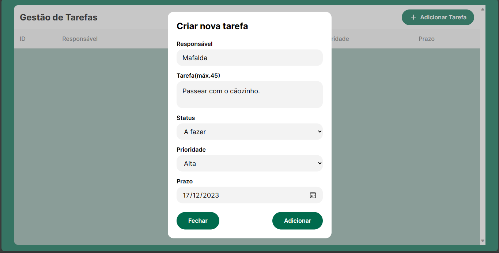

<br />
<div align="center">
 
  <h3 align="center">Gerenciador de tarefas</h3>

  <p align="center">
    Organize-se! Utilize este gerenciador de tarefas e acompanhe suas atividades.
    <br />
    </div>

<div align="center">


</div>

<h4 align="center"> 
	🚧 Aplicação em desenvolvimento 🚧
</h4>

## 💻 Sobre o projeto

Este sistema de gestão de tarefas foi criado, como aprimoramento de estudos em: ORM, Java/SpringBoot e API Rest. A aplicação dispõe ao usuário as funcionalidades de inserir e listar as tarefas, caso adicionadas.

## 🖼️ Preview

### Visão geral


### Adicionar tarefa



## ✨ Features

- Listar tarefa;
- Criar tarefa.

## ⚙️ Rodar localmente

Clone o projeto

```bash
  git clone https://github.com/lilo-afk/TasksManager.git
```

Abra o caminho do diretório do projeto

```bash
  cd TasksManager
```

Vscode (IDE)

```bash
  code  .
```

## 🛠 Tecnologias utilizadas

### Front-end:


### Back-end:


### Banco de dados:


### Ambiente de Desenvolvimento Integrado - IDE:


## 🤝 Como contribuir para o projeto

1. Faça um **fork** do projeto.

2. Crie uma nova branch com as suas alterações: `git checkout -b my-feature`

3. Salve as alterações e crie uma mensagem de commit contando o que você fez: `git commit -m "feature: My new feature"`

4. Envie as suas alterações: `git push origin my-feature`

## 📝 Licença

Este projeto está sob a licença [MIT](LICENSE). Consulte `LICENSE` para mais informações.

## ✒️ Autor


<a href="https://github.com/lilo-afk" ><sub><b>Lilo-afk</b></sub></a></a>

Feito com ❤️ por Murilo Martins Alves 👋🏽 Entre em contato!

[](https://www.linkedin.com/in/victor-silva-9485021b2/)
[](mailto:mma.murilo@gmail.com)
